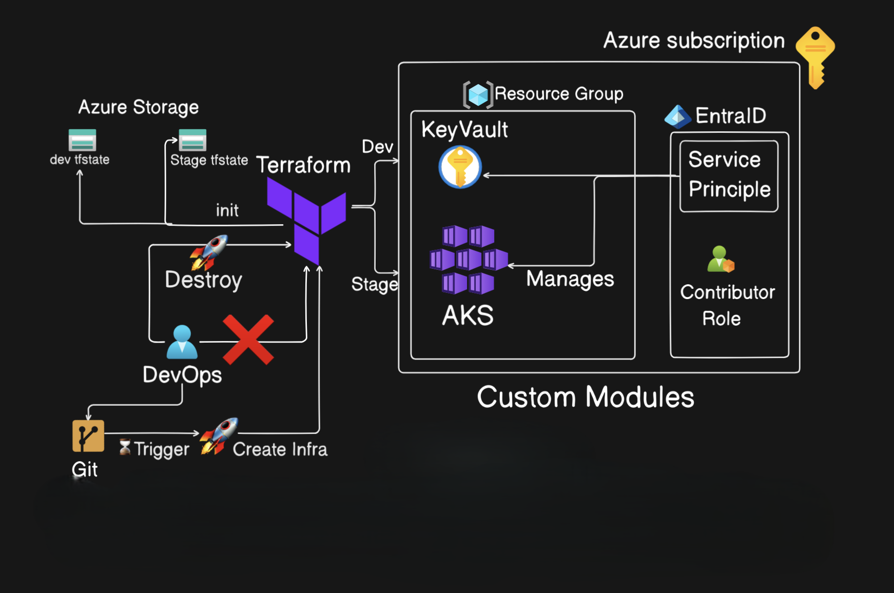
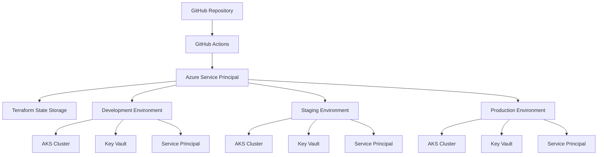

# Azure Infrastructure Deployment Platform 🚀

This project automates the deployment and management of Azure Kubernetes Service (AKS) infrastructure using Terraform, with CI/CD pipelines powered primarily by GitHub Actions and optionally by Azure DevOps. The infrastructure is defined using modular Terraform code and supports multiple environments such as Dev and Stage, each maintaining its own Terraform state file stored securely in Azure Storage. Upon code commits to Git, GitHub Actions are triggered to run Terraform commands (init, plan, and apply) to provision or update resources. Authentication to Azure is handled through a Service Principal registered in Microsoft Entra ID, which is granted the Contributor role at the subscription level, ensuring secure access to create and manage resources. A Resource Group is provisioned to contain AKS clusters and Azure Key Vaults, with the AKS cluster managing secure interactions with the vault. Destructive actions like terraform destroy are restricted from DevOps users to prevent accidental deletions. While GitHub Actions is the primary automation tool, Azure DevOps is also integrated as an alternative pipeline option for infrastructure deployment.



## 🚀 Quick Start

Get your Azure infrastructure running in minutes with this automated GitHub Actions workflows.

### 🎯 **Zero-Config Deployment**
1. Clone this repository
2. Configure Azure Service Principal credentials
3. Add Azure secrets to GitHub (5 secrets)
4. Push to main branch → Auto-deploy to development! 🚀

**[📖 Complete Setup Guide](./GITHUB_ACTIONS_SETUP.md)** | **[🤝 Contributing](./CONTRIBUTING.md)**

### ✨ Key Features:
- ✅ **Production-ready** AKS clusters with best practices
- ✅ **Automated CI/CD** with GitHub Actions
- ✅ **Multi-environment** support (development/staging/production)
- ✅ **Secure secret management** with Azure Key Vault
- ✅ **Infrastructure validation** and testing
- ✅ **Automated deployments** with rollback capabilities
- ✅ **Safe destroy workflows** with confirmation gates
- ✅ **Enterprise-grade** project structure and documentation

## 🏗️ Architecture Overview



## 📁 Project Structure

```
├── 📁 .github/workflows/       # 🤖 GitHub Actions CI/CD workflows
│   ├── terraform-deploy.yml     # 🚀 Main deployment workflow
│   └── terraform-destroy.yml   # 💥 Infrastructure destruction workflow
├── 📁 .vscode/                # 🛠️ VS Code workspace configuration
├── 📁 docs/                    # 📚 Documentation and diagrams
│   ├── architecture.png        # 🏛️ Infrastructure architecture
│   └── infrastructure.md       # 📋 Infrastructure details
├── 📁 infrastructure/          # 🏗️ Main Terraform infrastructure code
│   ├── 📁 environments/        # 🌍 Environment-specific configurations
│   │   ├── 📁 development/     # 🧪 Development environment
│   │   ├── 📁 staging/         # 🔄 Staging environment
│   │   └── 📁 production/      # 🏭 Production environment
│   ├── 📁 modules/             # 🧩 Reusable Terraform modules
│   │   ├── 📁 aks/             # ☸️ Kubernetes cluster module
│   │   ├── 📁 keyvault/        # 🔐 Secret management module
│   │   └── 📁 ServicePrincipal/# 🔑 Authentication module
│   ├── 📁 shared/              # 🤝 Shared configurations
│   └── 📄 README.md            # 📖 Infrastructure documentation
├── 📁 legacy/                  # 📜 Legacy Azure DevOps pipelines
├── 📁 scripts/                 # 📜 Setup and utility scripts
│   ├── setup-azure-sp.sh       # 🔧 Service Principal setup (Bash)
│   └── setup-azure-sp.ps1      # 🔧 Service Principal setup (PowerShell)
├── 📄 GITHUB_ACTIONS_SETUP.md  # 📖 Complete setup guide
├── 📄 CONTRIBUTING.md          # 🤝 Contribution guidelines
├── 📄 SECURITY.md              # 🔒 Security policy
├── 📄 CHANGELOG.md             # 📋 Version history
└── 📄 README.md                # 📄 This file
```

## 🛠️ Infrastructure Components

My project deploys a complete Azure infrastructure including:

### 🔧 **Core Infrastructure**
- **Resource Groups**: Organized environment separation
- **Storage Account**: Terraform state backend with encryption
- **Service Principals**: Secure authentication for applications

### ☸️ **Kubernetes Infrastructure**  
- **Azure Kubernetes Service (AKS)**: Managed Kubernetes clusters with best practices
- **Node Pools**: Auto-scaling compute resources
- **RBAC Integration**: Secure access controls
- **Network Policies**: Secure pod-to-pod communication

### 🔐 **Security & Secrets**
- **Azure Key Vault**: Centralized secret management
- **Service Principal Authentication**: Secure application access
- **Role-Based Access Control**: Least privilege principles
- **TLS/SSL Certificates**: Automated certificate management

### 🌍 **Multi-Environment Architecture**
| Environment | Resource Group | Purpose | Auto-Deploy | Location |
|-------------|----------------|---------|-------------|----------|
| **Shared** | `terraform-state-rg` | Terraform state storage | ✅ Always | `infrastructure/shared/` |
| **Development** | `dev-peter-rg` | Development workloads | ✅ On main push | `infrastructure/environments/development/` |
| **Staging** | `stage-peter-rg` | Pre-production testing | 🔄 Manual approval | `infrastructure/environments/staging/` |
| **Production** | `prod-peter-rg` | Production workloads | 🛡️ Protected branch | `infrastructure/environments/production/` |

## 🚀 Getting Started

### Prerequisites
- Azure subscription ([Get free account](https://azure.microsoft.com/free/))
- GitHub account
- Basic understanding of Terraform and Azure
- Azure CLI installed (optional, for local development)

### 1. Clone and Setup
```bash
git clone https://github.com/YOUR_USERNAME/gitactions-terraform.git
cd gitactions-terraform
```

### 2. Configure Azure Service Principal
```bash
# Run the setup script
./scripts/setup-azure-sp.sh
# Or use PowerShell version
./scripts/setup-azure-sp.ps1
```

### 3. Add GitHub Secrets
Add these 5 secrets to your GitHub repository settings:
- `AZURE_CLIENT_ID`
- `AZURE_CLIENT_SECRET`
- `AZURE_SUBSCRIPTION_ID`
- `AZURE_TENANT_ID`
- `AZURE_BACKEND_STORAGE_ACCOUNT`

### 4. Deploy Infrastructure
```bash
# Push to main branch triggers automatic deployment
git add .
git commit -m "feat: initial infrastructure deployment"
git push origin main
```

## 🔄 Workflow Operations

### Automatic Deployments
- **Development**: Auto-deploys on push to `main`
- **Staging**: Manual approval required
- **Production**: Protected branch workflow

### Manual Operations
- **Plan**: Create execution plan for review
- **Apply**: Deploy infrastructure changes
- **Destroy**: Safely tear down infrastructure

## 🛠️ Technical Stack

### Infrastructure as Code
- **Terraform** v1.5+ - Infrastructure provisioning and management
- **Azure Provider** v3.0+ - Azure resource management
- **GitHub Actions** - CI/CD automation and workflows

### Azure Services
- **Azure Kubernetes Service (AKS)** - Container orchestration
- **Azure Key Vault** - Secret and certificate management
- **Azure Active Directory** - Identity and access management
- **Azure Storage** - Terraform state backend
- **Azure Resource Manager** - Resource organization and governance

### Development Tools
- **VS Code** - Development environment with Terraform extensions
- **Azure CLI** - Local development and debugging
- **Git** - Version control and collaboration

## 🔧 Module Architecture

### Core Modules

#### 🏗️ **AKS Module** (`infrastructure/modules/aks/`)
```hcl
# Production-ready Kubernetes cluster
- Auto-scaling node pools
- Azure CNI networking
- Azure RBAC integration
- Monitoring and logging
- Security hardening
```

#### 🔐 **Key Vault Module** (`infrastructure/modules/keyvault/`)
```hcl
# Centralized secret management
- Certificate management
- Secret rotation policies
- Access policies and RBAC
- Network access restrictions
- Backup and recovery
```

#### 🔑 **Service Principal Module** (`infrastructure/modules/ServicePrincipal/`)
```hcl
# Secure authentication
- Application registration
- Role assignments
- Certificate-based auth
- Least privilege access
- Credential rotation
```

## ⚡ Quick Deployment Commands

### Environment Management
```bash
# Deploy to development
terraform -chdir=infrastructure/environments/development plan
terraform -chdir=infrastructure/environments/development apply

# Deploy to staging
terraform -chdir=infrastructure/environments/staging plan
terraform -chdir=infrastructure/environments/staging apply

# Deploy to production (requires approval)
terraform -chdir=infrastructure/environments/production plan
terraform -chdir=infrastructure/environments/production apply
```

### Destroy Resources
```bash
# Destroy development environment
terraform -chdir=infrastructure/environments/development destroy

# Use GitHub Actions destroy workflow for production
gh workflow run terraform-destroy.yml -f environment=production
```

## 🔍 Monitoring and Observability

### Built-in Monitoring
- **Azure Monitor** - Infrastructure and application metrics
- **Log Analytics** - Centralized logging and analysis
- **Application Insights** - Application performance monitoring
- **Azure Alerts** - Proactive issue detection

### GitHub Actions Insights
- **Workflow Status** - Real-time deployment tracking
- **Resource Drift Detection** - Configuration compliance
- **Cost Tracking** - Infrastructure cost monitoring
- **Security Scanning** - Vulnerability assessments

## 🚨 Troubleshooting Guide

### Common Issues
| Issue | Solution | Documentation |
|-------|----------|---------------|
| Authentication Failed | Check service principal credentials | [Setup Guide](./GITHUB_ACTIONS_SETUP.md#authentication) |
| State Lock Conflicts | Release state lock manually | [State Management](./docs/state-management.md) |
| Resource Conflicts | Check resource naming conventions | [Naming Guide](./docs/naming-conventions.md) |
| Permission Denied | Verify RBAC assignments | [Security Guide](./SECURITY.md) |

### Support Resources
- 📖 [Infrastructure Documentation](./infrastructure/README.md)
- 🔒 [Security Best Practices](./SECURITY.md)
- 🐛 [Issue Templates](./.github/ISSUE_TEMPLATE/)
- 💬 [Discussion Forum](https://github.com/Peter-Opapa/gitactions-terraform/discussions)

## 🏆 Production Features

### Enterprise Grade
- ✅ **High Availability** - Multi-zone AKS deployments
- ✅ **Auto Scaling** - Horizontal and vertical pod autoscaling
- ✅ **Disaster Recovery** - Cross-region backup strategies
- ✅ **Security Hardening** - CIS benchmarks and security policies
- ✅ **Compliance Ready** - SOC 2, ISO 27001 framework support

### DevOps Best Practices
- ✅ **GitOps Workflows** - Infrastructure as code versioning
- ✅ **Automated Testing** - Infrastructure validation and testing
- ✅ **Rollback Capabilities** - Safe deployment rollback mechanisms
- ✅ **Environment Parity** - Consistent dev/staging/production environments
- ✅ **Change Management** - Structured approval processes

## 📊 Cost Optimization

### Resource Efficiency
- **Spot Instances** - Cost-effective compute for development
- **Auto-shutdown** - Automatic resource cleanup
- **Resource Tagging** - Detailed cost allocation and tracking
- **Right-sizing** - Optimal resource sizing recommendations

### Budget Controls
- **Cost Alerts** - Proactive spending notifications
- **Resource Quotas** - Environment-specific resource limits
- **Policy Enforcement** - Automated compliance and governance

## 📚 Documentation

### Essential Guides
- [🚀 **GitHub Actions Setup**](./GITHUB_ACTIONS_SETUP.md) - Complete CI/CD setup guide
- [🏗️ **Infrastructure Guide**](./infrastructure/README.md) - Technical infrastructure details
- [🔒 **Security Policy**](./SECURITY.md) - Security best practices and policies
- [🤝 **Contributing**](./CONTRIBUTING.md) - How to contribute to this project

### Advanced Topics
- [Multi-Environment Strategy](./docs/multi-environment.md)
- [Azure Best Practices](./docs/azure-best-practices.md)
- [Monitoring and Alerting](./docs/monitoring.md)
- [Disaster Recovery](./docs/disaster-recovery.md)

## 🤝 Contributing

I welcome contributions! Please see the [Contributing Guide](./CONTRIBUTING.md) for details.

### Development Workflow
1. Fork the repository
2. Create a feature branch
3. Make your changes
4. Test thoroughly
5. Submit a pull request

## 📄 License

This project is licensed under the MIT License - see the [LICENSE](LICENSE) file for details.

## 🔗 Resources

- [Terraform Documentation](https://www.terraform.io/docs)
- [Azure Documentation](https://docs.microsoft.com/azure)
- [GitHub Actions Documentation](https://docs.github.com/actions)
- [Kubernetes Documentation](https://kubernetes.io/docs)

## 🙏 Acknowledgments

Built with ❤️ by Peter for the DevOps community. This platform demonstrates enterprise-grade infrastructure automation best practices.

---

**Ready to deploy enterprise Azure infrastructure? Start with the [GitHub Actions Setup Guide](./GITHUB_ACTIONS_SETUP.md)!** 🚀
